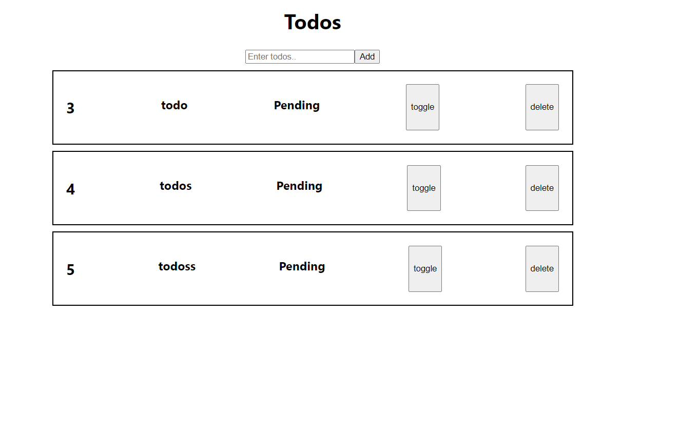

# Full stack todo app

### Instructions to run the project

* After cloning the repo, run npm start to run the backend server
* After that in terminal change the directory to "cd /client"
* then run npm start to run the frontend
* Now you can see the ui and use it.

### Some glimpse of the UI

